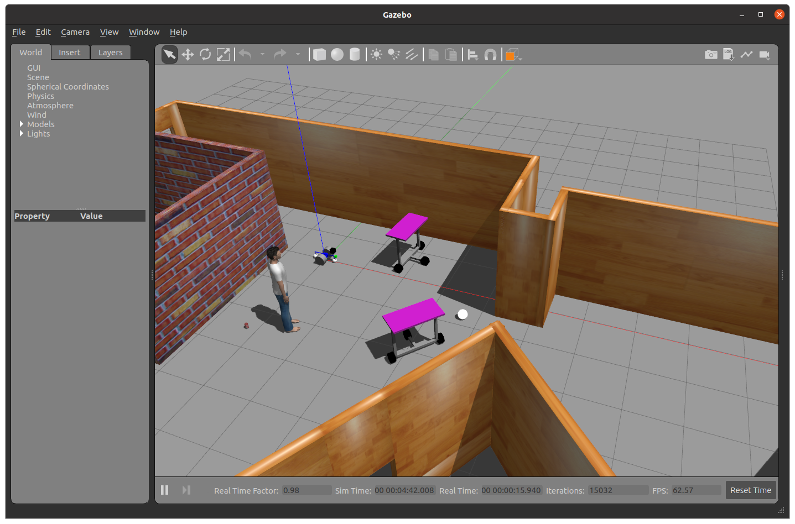

# Ball Chaser Bot

This ROS project spawns a world in which a robot is pre-programmed to chase a white ball.

## Instructions

### 1. Build the workspace

```
$ cd src
src $ catkin_make
```

### 2. Launch the world

```
src $ source devel/setup.bash
src $ roslaunch my_robot world.launch
```

You should be able to see the world in gazebo, as well as rviz.

<center></center>

Note that rviz displays the the robot's lidar information and the robot's camera image.

<center></center>

### 3. Launch the nodes that control the robot

In a new terminal:

```
src $ source devel/setup.bash
src $ roslaunch ball_chaser ball_chaser.launch
```

The robot should start moving towards the ball and stop when it's close.

<center></center>

### 4. Play with the ball

In Gazebo, select the translation mode (T), move the ball away, and wait for the robot to find it again!

Note that the robot will only rotate in place while the ball is not visible, so if the ball is not in a place with direct line of sight from the robot, it will not try to find it.

<center></center>
