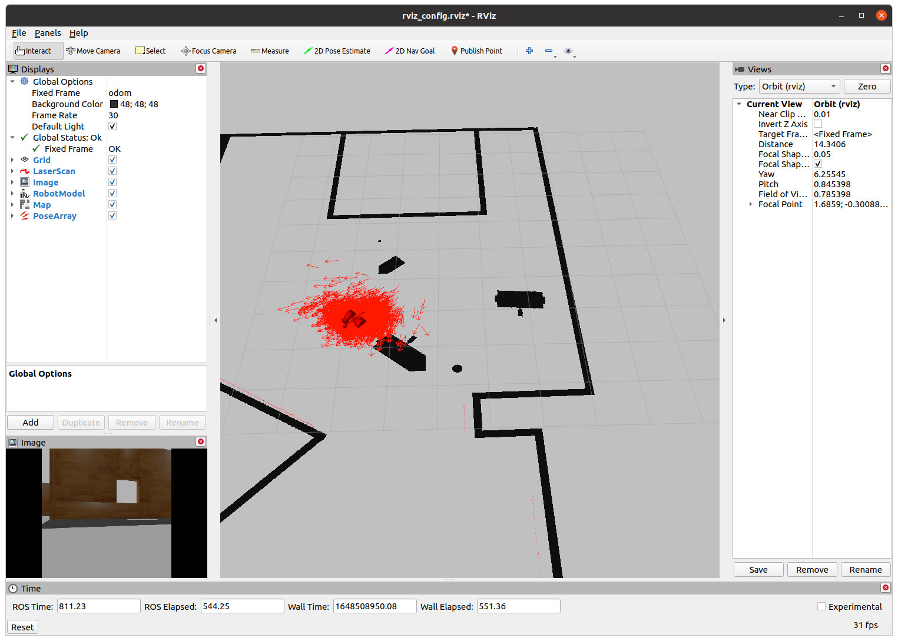
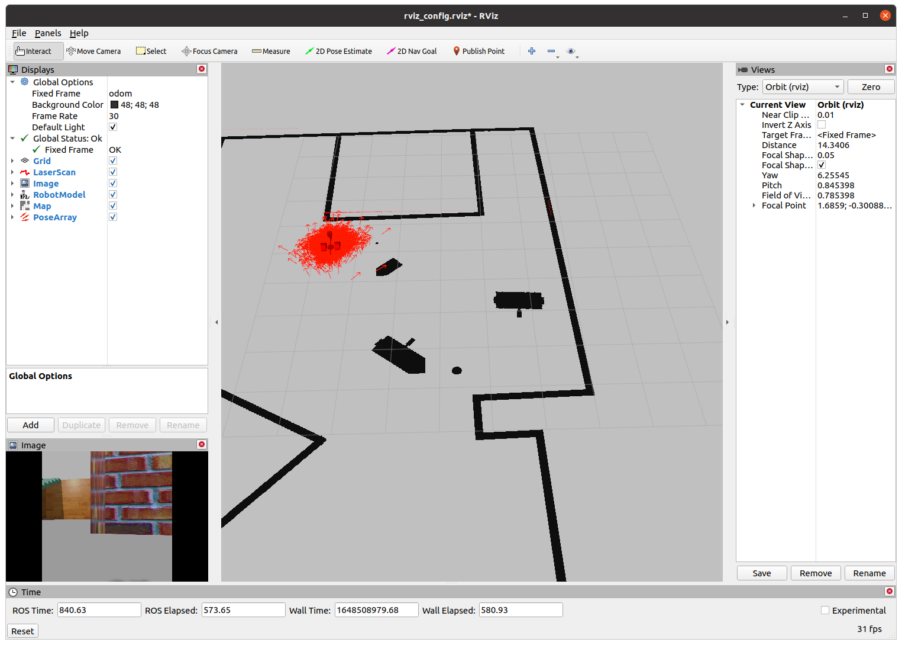

# ROS Localization

This ROS project spawns a world in which the robot uses Adaptive Monte Carlo localization, by leveraging ROS' AMCL package.

* [Libraries](#libraries)
* [Instructions](#instructions)
* [Screenshots](#screenshots)
* [Notes](#notes)

## Libraries

This project includes code from two ROS packages:

* [pgm_map_creator](./catkin_ws/src/pgm_map_creator/) from https://github.com/hyfan1116/pgm_map_creator
* [teleop_twist_keyboard](./catkin_ws/src/teleop_twist_keyboard/) from https://github.com/ros-teleop/teleop_twist_keyboard

### Versions

This project has been built for Ubuntu 20 with ROS-noetic:

```
$ lsb_release -d
Description:	Ubuntu 20.04.4 LTS

$ dpkg -s libboost-dev | grep 'Version'
Version: 1.71.0.0ubuntu2

$ rosversion -d
noetic
```

## Instructions

### 1. Build the workspace

```
$ cd catkin_ws
catkin_ws $ catkin_make
```

Note that since this project has been built in Ubuntu 20 with ROS-noetic, it required making some code changes to `pgm_map_creator`. See [Notes on pmg_map_creator package](#notes-on-pmgmapcreator-package).

**If you have trouble compiling this package**, you can simply remove that folder, since the map is already generated in [the maps folder](./catkin_ws/src/my_robot/maps/).

<center></center>

### 2. Launch the world

```
catkin_ws $ source devel/setup.bash
catkin_ws $ roslaunch my_robot world.launch
```

You should be able to see the world in gazebo, as well as rviz.

<center></center>

Note that rviz displays the robot's lidar information and the robot's camera image.

<center></center>

### 3. Launch the nodes that provide localization to the robot

In a new terminal:

```
catkin_ws $ source devel/setup.bash
catkin_ws $ roslaunch my_robot amcl.launch
```

Rviz should now display Monte Carlo's particles, along with the map.

<center></center>


### 4. Move the robot

Although the previous step also provides `move_base` node from ROS navigation, I have also added the teleop node so the robot can be controlled with keyboard. Launch that node now:

In a new terminal:

```
catkin_ws $ source devel/setup.bash
catkin_ws $ rosrun teleop_twist_keyboard teleop_twist_keyboard.py

Reading from the keyboard  and Publishing to Twist!
---------------------------
Moving around:
   u    i    o
   j    k    l
   m    ,    .

...
```

As the robot moves, the Monte Carlo particles will update in rviz and the robot will start to be properly localized in the map, which is made clear by the rotation of the map starting to align with the laser scan.

<center></center>

## Screenshots

---

Localization at start, with wrong initial rotation estimation:

<center></center>

---

Localization updates while moving:

<center></center>

---

Robot continues to localize when moving close to the wall:

<center></center>

---

Actual location of the robot close to the location predicted by AMCL:

<center></center>


## Notes

### Notes on pmg_map_creator package

I made some changes with respect to [pgm_map_creator](https://github.com/hyfan1116/pgm_map_creator), which is implemented for `Ubuntu 16.04, ROS Kinetic, Boost 1.58`, so it compiles for `Ubuntu 20.04.4, ROS Noetic, Boost 1.71`. If you have trouble compiling this package, you can simply remove that folder, since the map is already generated in [the maps folder](./catkin_ws/src/my_robot/maps/).

<center></center>

The changes are listed here:
```
$ git diff CMakeLists.txt
-set (CMAKE_CXX_FLAGS "-g -Wall -std=c++11")
+set (CMAKE_CXX_FLAGS "-g -Wall -std=c++17 -pthread")

$ git diff msgs/CMakeLists.txt
-  ${PROTOBUF_IMPORT_DIRS}/vector2d.proto
-  ${PROTOBUF_IMPORT_DIRS}/header.proto
-  ${PROTOBUF_IMPORT_DIRS}/time.proto
+  # ${PROTOBUF_IMPORT_DIRS}/vector2d.proto
+  # ${PROTOBUF_IMPORT_DIRS}/header.proto
+  # ${PROTOBUF_IMPORT_DIRS}/time.proto

$ git diff src/collision_map_creator.cc
-#include <boost/gil/gil_all.hpp>
-#include <boost/gil/extension/io/png_dynamic_io.hpp>
+#include <boost/gil.hpp>
+#include <boost/gil/extension/io/png.hpp>
```