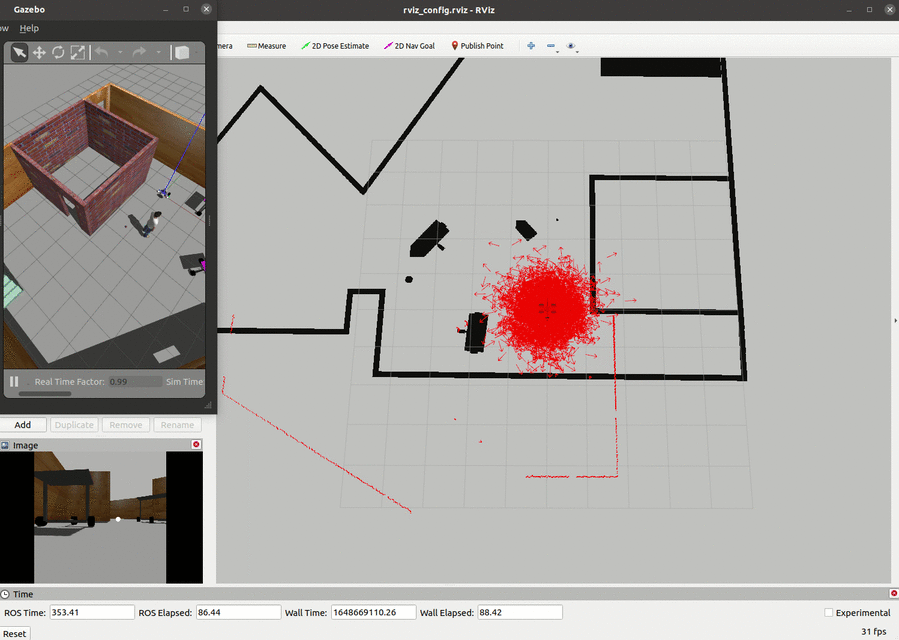

# ROS Localization

This ROS project spawns a world in which the robot uses Adaptive Monte Carlo localization, by leveraging ROS' AMCL package.

* [Libraries](#libraries)
* [Instructions](#instructions)
* [Screenshots](#screenshots)
* [Notes](#notes)

## Libraries

This project includes code from two ROS packages:

* [pgm_map_creator](./catkin_ws/src/pgm_map_creator/) from https://github.com/hyfan1116/pgm_map_creator
* [teleop_twist_keyboard](./catkin_ws/src/teleop_twist_keyboard/) from https://github.com/ros-teleop/teleop_twist_keyboard

### Versions

This project has been built for Ubuntu 20 with ROS-noetic:

```
$ lsb_release -d
Description:	Ubuntu 20.04.4 LTS

$ dpkg -s libboost-dev | grep 'Version'
Version: 1.71.0.0ubuntu2

$ rosversion -d
noetic
```

## Instructions

### 1. Build the workspace

```
$ cd catkin_ws
catkin_ws $ catkin_make
```

Note that since this project has been built in Ubuntu 20 with ROS-noetic, it required making some code changes to `pgm_map_creator`. See [Notes on pmg_map_creator package](#notes-on-pmgmapcreator-package).

**If you have trouble compiling this package**, you can simply remove that folder, since the map is already generated in [the maps folder](./catkin_ws/src/my_robot/maps/).

<p align="center"></p>

### 2. Launch the world

```
catkin_ws $ source devel/setup.bash
catkin_ws $ roslaunch my_robot world.launch
```

You should be able to see the world in gazebo, as well as rviz.

<p align="center"></p>

Note that rviz displays the robot's lidar information and the robot's camera image.

<p align="center"></p>

### 3. Launch the nodes that provide localization to the robot

In a new terminal:

```
catkin_ws $ source devel/setup.bash
catkin_ws $ roslaunch my_robot amcl.launch
```

Rviz should now display Monte Carlo's particles, along with the map.

<p align="center"></p>


### 4. Move the robot

Although the previous step also provides `move_base` node from ROS navigation, I have also added the teleop node so the robot can be controlled with keyboard. Launch that node now:

In a new terminal:

```
catkin_ws $ source devel/setup.bash
catkin_ws $ rosrun teleop_twist_keyboard teleop_twist_keyboard.py

Reading from the keyboard  and Publishing to Twist!
---------------------------
Moving around:
   u    i    o
   j    k    l
   m    ,    .

...
```

## Screenshots

---

Localization at start, with wrong initial rotation estimation. Note that for this project we provide a bad rotation estimate (90 degree offset), and instead provide a high initial rotation covariance, to allow AMCL to localize from the inaccurate estimate.

From [amcl.launch](./catkin_ws/src/my_robot/launch/amcl.launch):
```
        <!-- For rotation, instead of providing an accurate estimate, we provide a wide
            initial covariance. The robot actual pose has a 90deg (1.57rad) offset wrt,
            so we initialize AMCL with a covariance that can cover that offset.

            This would be an accurate rotation estimate:
            <param name="initial_pose_a" value="-1.57"/> 
        -->
        <!-- Set covariance slightly larger than 1.57^2 -->
        <param name="initial_cov_aa" value="2.5"/>
```

<p align="center"></p>

---

Localization updates while moving:

<p align="center">
   
</p>

---

Example of localization:

<p align="center"></p>


## Notes

### Notes on pmg_map_creator package

I made some changes with respect to [pgm_map_creator](https://github.com/hyfan1116/pgm_map_creator), which is implemented for `Ubuntu 16.04, ROS Kinetic, Boost 1.58`, so it compiles for `Ubuntu 20.04.4, ROS Noetic, Boost 1.71`. If you have trouble compiling this package, you can simply remove that folder, since the map is already generated in [the maps folder](./catkin_ws/src/my_robot/maps/).

<p align="center"></p>

The changes are listed here:
```
$ git diff CMakeLists.txt
-set (CMAKE_CXX_FLAGS "-g -Wall -std=c++11")
+set (CMAKE_CXX_FLAGS "-g -Wall -std=c++17 -pthread")

$ git diff msgs/CMakeLists.txt
-  ${PROTOBUF_IMPORT_DIRS}/vector2d.proto
-  ${PROTOBUF_IMPORT_DIRS}/header.proto
-  ${PROTOBUF_IMPORT_DIRS}/time.proto
+  # ${PROTOBUF_IMPORT_DIRS}/vector2d.proto
+  # ${PROTOBUF_IMPORT_DIRS}/header.proto
+  # ${PROTOBUF_IMPORT_DIRS}/time.proto

$ git diff src/collision_map_creator.cc
-#include <boost/gil/gil_all.hpp>
-#include <boost/gil/extension/io/png_dynamic_io.hpp>
+#include <boost/gil.hpp>
+#include <boost/gil/extension/io/png.hpp>
```