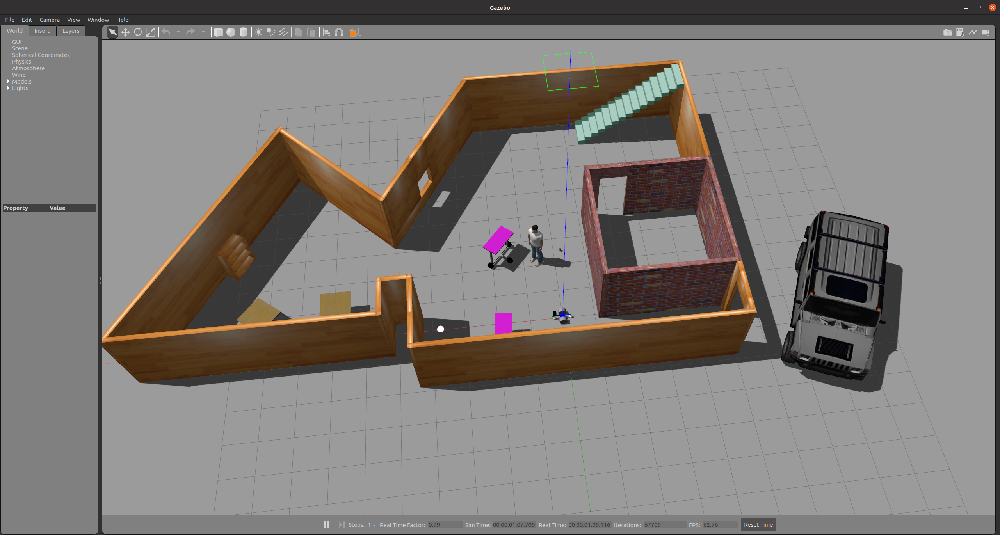
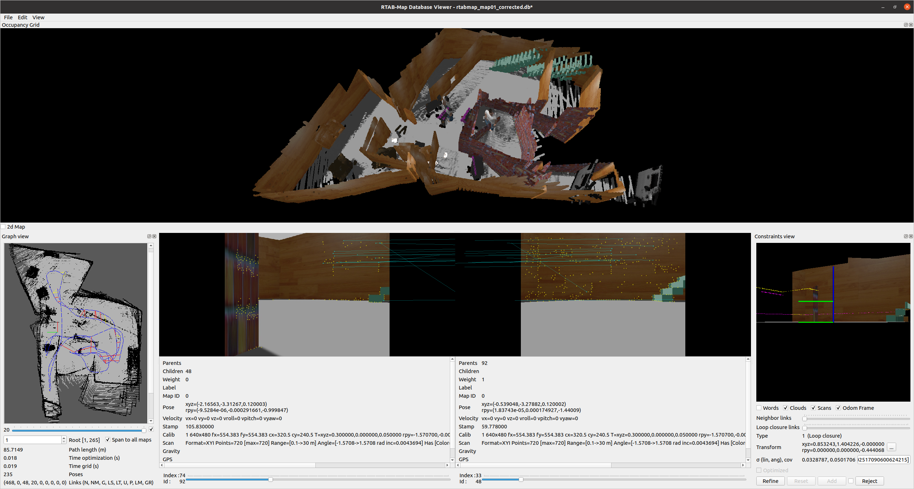
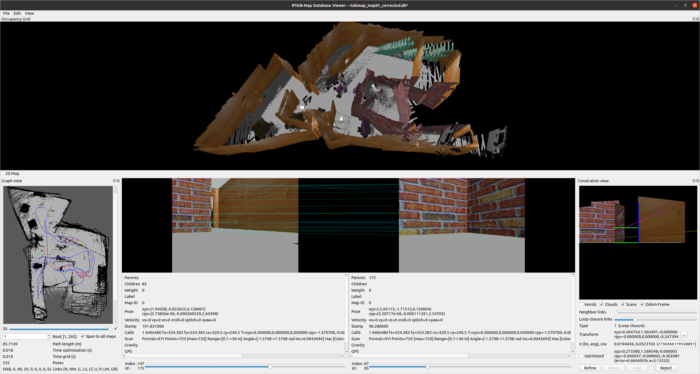
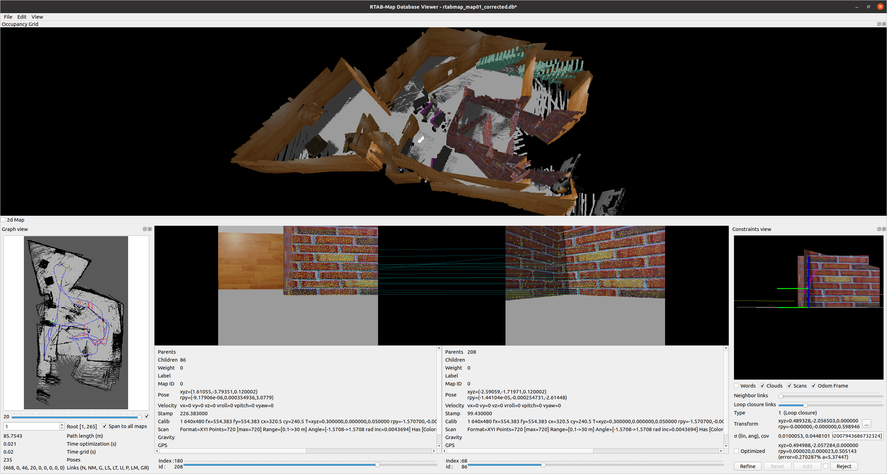
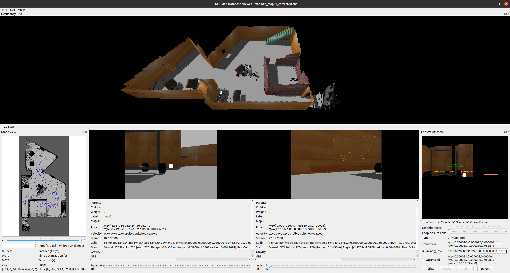
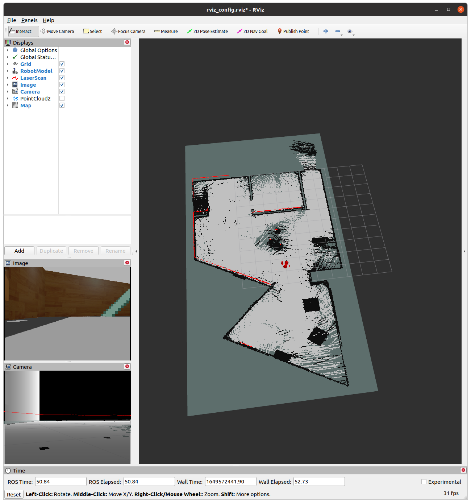

# ROS Mapping

This ROS project spawns a world in which the robot uses RTAB-map to map the environment.

* [Libraries](#libraries)
* [Instructions](#instructions)
* [Screenshots](#screenshots)
* [Notes](#notes)

# Libraries

This project includes code from the ROS package:

* [teleop_twist_keyboard](./catkin_ws/src/teleop_twist_keyboard/) from https://github.com/ros-teleop/teleop_twist_keyboard

## Versions

This project has been built for Ubuntu 20 with ROS-noetic:

```
$ lsb_release -d
Description:	Ubuntu 20.04.4 LTS

$ dpkg -s libboost-dev | grep 'Version'
Version: 1.71.0.0ubuntu2

$ rosversion -d
noetic
```

# Instructions

### Requirements

This project relies on the [RTAB-map package ](http://wiki.ros.org/rtabmap_ros). The package can be installed with apt-get for your ROS distribution. For example, for *noetic*:

```
$ sudo apt-get install ros-noetic-rtabmap
Reading package lists... Done
Building dependency tree       
Reading state information... Done
ros-noetic-rtabmap is already the newest version (0.20.18-3focal.20220303.214015).
ros-noetic-rtabmap set to manually installed.
```

Now you can follow the execution steps:

### 1. Build the workspace


```
$ cd catkin_ws
catkin_ws $ catkin_make
```

### 2. Launch the world

In a new terminal:

```
catkin_ws $ source devel/setup.bash
catkin_ws $ roslaunch my_robot world.launch
```

### 3. Launch the nodes that provide mapping to the robot

In a new terminal:

```
catkin_ws $ source devel/setup.bash
catkin_ws $ roslaunch my_robot mapping.launch
```

### 4. Move the robot

In a new terminal:

```
catkin_ws $ source devel/setup.bash
catkin_ws $ roslaunch my_robot teleop.launch

Reading from the keyboard  and Publishing to Twist!
---------------------------
Moving around:
   u    i    o
   j    k    l
   m    ,    .

...
```

## Screenshots

---

This is the world we are going to map:

<p align="center"></p>

Note that there are two worlds: [world.world](./catkin_ws/src/my_robot/worlds/world.world) and [world_with_features.world](./catkin_ws/src/my_robot/worlds/world_with_features.world). The one we display here is [world_with_features.world](./catkin_ws/src/my_robot/worlds/world_with_features.world), which contains more objects to more easily distinguish locations from camera images.

The desired world is set in [world.launch](./catkin_ws/src/my_robot/launch/world.launch).

---

After running around, the robot will create a map and a database following the RTAB-map algorithm. Here we inspect the database and see the result of one of such runs. Unfortunately, the algorithm has trouble building the map because there are several positions that look the same, due to the robot walking too close to walls that look identical.

<p align="center">
   
</p>

---

In this editor, we can identify two loop closures that are not correct, and we can flag them in the database for rejection:

Correction 1:

<p align="center"></p>

Correction 2:

<p align="center"></p>

Note how in one case the left side of corner looks very similar to a wall in a different location, while in the other it was the right side of the same corner that look similar to another location.

---

After rejecting the unexpected loop closures, the algorithm is able to reconstruct the 2d and 3d maps properly:

<p align="center"></p>

---

This corrected map can now be used for localization. In order to do so, instead of executing [mapping.launch](./catkin_ws/src/my_robot/launch/mapping.launch), you can run [localization.launch](./catkin_ws/src/my_robot/launch/localization.launch) during step `3`:

```
catkin_ws $ source devel/setup.bash
catkin_ws $ roslaunch my_robot localization.launch
```

In that case, the robot will localize leveraging the existin map:

<p align="center"></p>

## Notes

Please note that editing maps is often needed in real scenarios. See [this Udacity knowledge base question](https://knowledge.udacity.com/questions/828996) for information.

### Accessing the pre-built maps

The pre-built maps can be foundd here [_databases](./catkin_ws/src/my_robot/_databases/):

* [rtabmap_map01.db](./catkin_ws/src/my_robot/_databases/rtabmap_map01.db): Is the map as generated in the test run, including its invalid loop closures.
* [rtabmap_map01_corrected.db](./catkin_ws/src/my_robot/_databases/rtabmap_map01_corrected.db): Is the resulting map once the invalid loop closures are rejected during manual edition.

In order to download these map when syncing the repository it is necessary to install [git-lfs](https://git-lfs.github.com/) *Git Large File Storage*, before cloning the repository.

```
$ sudo apt-get install git-lfs
```

Without *git-lfs* the files are simply text files with a hash. Note how their size is `134 bytes`:
```
 $ git clone git@github.com:samraul/udacity_robotics_swe_public.git
Cloning into 'udacity_robotics_swe_public'...
...
Resolving deltas: 100% (56/56), done.

 $ ls -las ./udacity_robotics_swe_public/project4_rosMapping/catkin_ws/src/my_robot/_databases/
4 ****** samraul  134 Apr 10 00:45 rtabmap_map01_corrected.db
4 ****** samraul  134 Apr 10 00:45 rtabmap_map01.db

$ cat ./udacity_robotics_swe_public/project4_rosMapping/catkin_ws/src/my_robot/_databases/rtabmap_map01.db 
version https://git-lfs.github.com/spec/v1
oid sha256:e39ebe311dd4e21874fab0aa1557cd8223743816ed69711d84f430f070257a98
size 130347008
```

Once *git-lfs* is installed, the files are properly expanded to their actual size of `130MB` when the repository is cloned:

```
$ sudo apt-get install git-lfs
Reading package lists... Done
Building dependency tree       
Reading state information... Done
The following NEW packages will be installed:
  git-lfs
...

$ git clone git@github.com:samraul/udacity_robotics_swe_public.git
Cloning into 'udacity_robotics_swe_public'...
...
Filtering content: 100% (2/2), 248.63 MiB | 60.89 MiB/s, done.

$ ls -las ./udacity_robotics_swe_public/project4_rosMapping/catkin_ws/src/my_robot/_databases/
total 254600
127300 ****** samraul 130355200 Apr 10 00:48 rtabmap_map01_corrected.db
127292 ****** samraul 130347008 Apr 10 00:48 rtabmap_map01.db

```