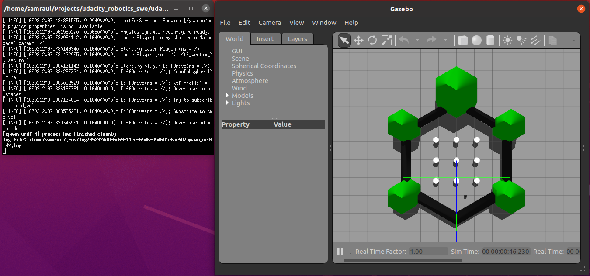

# ROS Home Service Robot

This ROS project spawns a world in which a robot is able to go to a location to pick up and object (virtually), and subsequently go to another location to virtually drop the object.

<p align="center">
   
</p>

* [Intro](#intro)
* [Libraries](#libraries)
* [Instructions](#instructions)
* [Screenshots](#screenshots)
    * [Disecting the full demo script](#disecting-the-full-demo-script)

# Intro

For this project we are going to use [turtlebot3](https://emanual.robotis.com/docs/en/platform/turtlebot3/overview/), specifically the *burger* configuration. Using an existing robot with powerful existing configuration allows us to integrate together all the components required for this demo, while leveraging the configuration files to find proper parameters and tweaks for those components.

<p align="center">
   
</p>

Note also we will be using ROS *noetic* distribution.

# Libraries

This project includes code from the ROS packages:

* [slam_gmapping](./catkin_ws/src/slam_gmapping) from https://github.com/ros-perception/slam_gmapping
* [turtlebot_interactions](./catkin_ws/src/turtlebot_interactions/) from https://github.com/turtlebot/turtlebot_interactions
* [turtlebot3](./catkin_ws/src/turtlebot3) from https://github.com/ROBOTIS-GIT/turtlebot3
* [turtlebot3_msgs](./catkin_ws/src/turtlebot3_msgs) from https://github.com/ROBOTIS-GIT/turtlebot3_msgs
* [turtlebot3_simulations](./catkin_ws/src/turtlebot3_simulations) from https://github.com/ROBOTIS-GIT/turtlebot3_simulations/


## Versions

This project has been built for Ubuntu 20 with ROS-noetic:

```
$ lsb_release -d
Description:	Ubuntu 20.04.4 LTS

$ dpkg -s libboost-dev | grep 'Version'
Version: 1.71.0.0ubuntu2

$ rosversion -d
noetic
```

# Instructions

### Requirements

The package dependencies are included in the src folder (see [Libraries](#libraries)), therefor no additional installation should be required to compile the project. Please contact the author if you have any issues building the project.

---

### 1. Build the workspace


```
$ cd catkin_ws
catkin_ws $ catkin_make
```

This command will build the dependencies along with 4 new targets:
* **libmy_pick_objects**: library with goal definition code that *my_add_markers* and *my_add_markers_timed* depend on.
* **my_pick_objects_node**: executable that moves the robot to the pick up and drop off locations.
* **my_add_markers**: executable that shows marker at pick up and drop off locations during robot navigation, when the robot reaches the locations.
* **my_add_markers_timed**: executable that shows marker at pick up and drop off locations with timers (no robot navigation required).


### 2. Use the provided scripts to see different stages of the project

```
catkin_ws $ source devel/setup.bash
catkin_ws $ ./src/scripts/<<script_file.sh>>
```
Where the available scripts are (in ascending order of functionality):
* [test_slam.sh](./catkin_ws/src/scripts/test_slam.sh): tests integration of SLAM components (gmapping) to generate the world's map.
* [test_navigation.sh](./catkin_ws/src/scripts/test_navigation.sh): tests integration of Localization & Navigation components (AMCL) to move the robot autonomously.
* [test_pick_up_objects.sh](./catkin_ws/src/scripts/test_pick_up_objects.sh): tests integration of the custom node that commands the robot to the pick up and drop off locations.
* [test_add_markers.sh](./catkin_ws/src/scripts/test_add_markers.sh): tests integration of the custom node that adds visual markers in rviz at the pick up and drop off locations defined in `my_pick_objects` node.
* [home_service.sh](./catkin_ws/src/scripts/home_service.sh): script with the entire functionality, automatically navigating to pick up and drop off the object, while showing the markers at their respective locations at the right times.

You likely want to run the full demo script:

```
catkin_ws $ ./src/scripts/home_service.sh
```

## Screenshots

### Disecting the full demo script

Here we describe some details of the final configuration of the demo script, specifically about the commands that launch in external terminals. Please note that some commands have been removed from this condensed view. For the full code check out the raw file: [home_service.sh](./catkin_ws/src/scripts/home_service.sh).

```
export TURTLEBOT3_MODEL="burger"

# Launch turtlebot3 in a world
xterm -e " roslaunch turtlebot3_gazebo turtlebot3_world.launch " &

# Publish robot data to TF
xterm -e " roslaunch turtlebot3_bringup turtlebot3_model.launch " &

# Launch rviz config (will override the default one launched by bringup)
xterm -e " roslaunch my_rviz view_navigation_with_markers.launch " &

# Launch Map server with the map generated with gmapping
xterm -e " roslaunch my_map_server map_server.launch " &

# Launch AMCL
xterm -e " roslaunch turtlebot3_navigation amcl.launch initial_pose_x:=-2.0 initial_pose_y:=-0.5 " &

# Launch MoveBase (with proper parameters)
xterm -e " roslaunch turtlebot3_navigation move_base.launch " &

# Launch add markers node
xterm -e " rosrun my_add_markers my_add_markers " &

# Launch pick up objects
xterm -e " rosrun my_pick_objects my_pick_objects_node " &
```

0. Before we begin, we must specify the type of turtlebot3 that we are using:
```
export TURTLEBOT3_MODEL="burger"
```

1. We can now launch the world with the robot in gazebo. This world provides an interesting environment for navigation since there are several obstacles in the room. It is also interesting for SLAM and localization, given that there are several places with similar features, which might add location ambiguity. Fortunately, there are also some distinct features in the walls that allow the robot to localize properly.

```
xterm -e " roslaunch turtlebot3_gazebo turtlebot3_world.launch " &
```

<p align="center">
   
</p>

2. Next, we need to add an additional call to make the robot publish its transformation to TF, which is required by most of the components we will ran later. Note that this launch file will also launch an *rviz* instance. This can be ignored, since its configuration will be overridden later.

```
xterm -e " roslaunch turtlebot3_bringup turtlebot3_model.launch " &
```

<p align="center">
   
</p>

3. We have a specific configuration of *rviz* that we would like. This configuration adds marker visualization to a navigation configuration provided by turtlebot3. You will see how the previous window (from step 2) will inform that *rviz* is closed because a new one is launched.

```
xterm -e " roslaunch my_rviz view_navigation_with_markers.launch " &
```

<p align="center">
   
</p>

4. The following step is to launch the map server. This will provide a pre-generated map to AMCL. Generation of the map is beyond the scope of this explanation, but it can be achieved by saving the map generated after navigating the world with the script [test_slam.sh](./catkin_ws/src/scripts/test_slam.sh).

```
xterm -e " roslaunch my_map_server map_server.launch " &
```

<p align="center">
   
</p>

5. It's time for AMCL, which will provide localization to the robot. Note that the actual initial location of the robot in the world is `[-2.0, -0.5, 0.0]`. We need to provide this information to the launch script. Once we launch the node we can already see the robot and the MCL particles at the expected location, although it is not yet fully localized!

```
xterm -e " roslaunch turtlebot3_navigation amcl.launch initial_pose_x:=-2.0 initial_pose_y:=-0.5 " &
```

<p align="center">
   
</p>

6. With AMCL ready, we can launch *move_base*, the package that will provide navigation for the robot. We leverage as much as possible the provided configuration files, since properly tweaking all these packages is very important. As soon as it launches, we can see the global and local navigation cost maps!

```
xterm -e " roslaunch turtlebot3_navigation move_base.launch " &
```

<p align="center">
   
</p>

7. We are almost at the end, ready to launch our custom nodes. The first one is the node that adds the custom marker at the pick up location. You will see a green box appear at the expected location in the map. This location is defined in `my_pick_objects` [goal_definitions.cpp](./catkin_ws/src/my_pick_objects/src/goal_definitions.cpp), which `my_add_markers` depends on.

```
xterm -e " rosrun my_add_markers my_add_markers " &
```

<p align="center">
   
</p>

8. Finally, we are ready to launch the node that will command the robot to pick up the object and drop it off. Note how the markers update properly when the robot reaches each destination!

```
xterm -e " rosrun my_pick_objects my_pick_objects_node " &
```

<p align="center">
   
</p>

9. Enjoy watching the robot going to pick up the object and dropping it off afterwards!

<p align="center">
   
</p>
